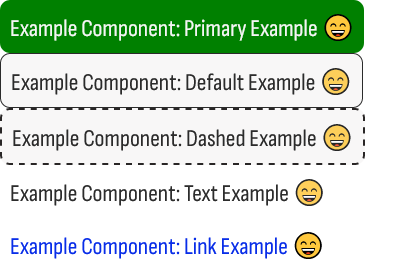

# zyra-ui

> Simple button designs for your projects. Selectable types: primary, default, dashed, text and link.



[](https://www.npmjs.com/package/zyra-ui) [](https://standardjs.com)

> You can check the project on [GitHub](https://github.com/beyazite/zyra-ui)

## Install

```bash
npm install --save zyra-ui
```

## Usage

```jsx
import React, { Component } from 'react'

import {ZyraButton} from 'zyra-ui'
import 'zyra-ui/dist/index.css'

class Example extends Component {
  render() {
    return <ZyraButton type="selected-type-comes-here" text="your-button-text-comes-here" />
  }
}
```

## License

MIT © [beyazite](https://github.com/beyazite)

